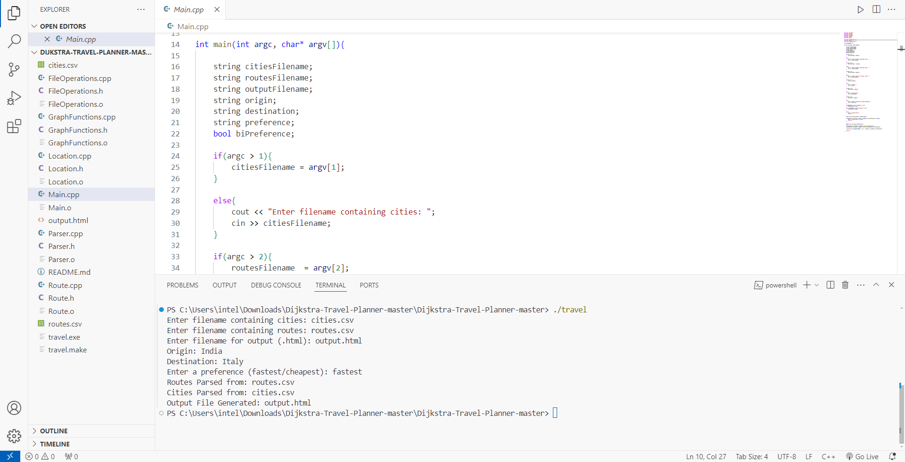
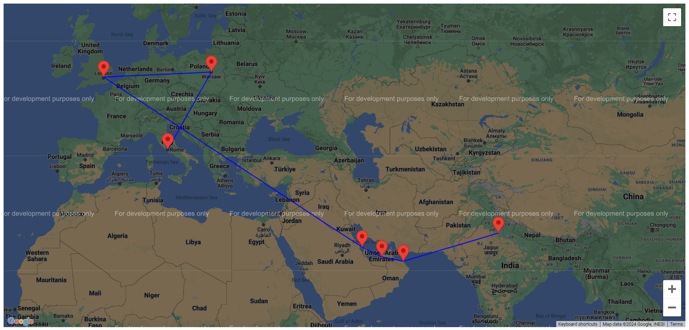
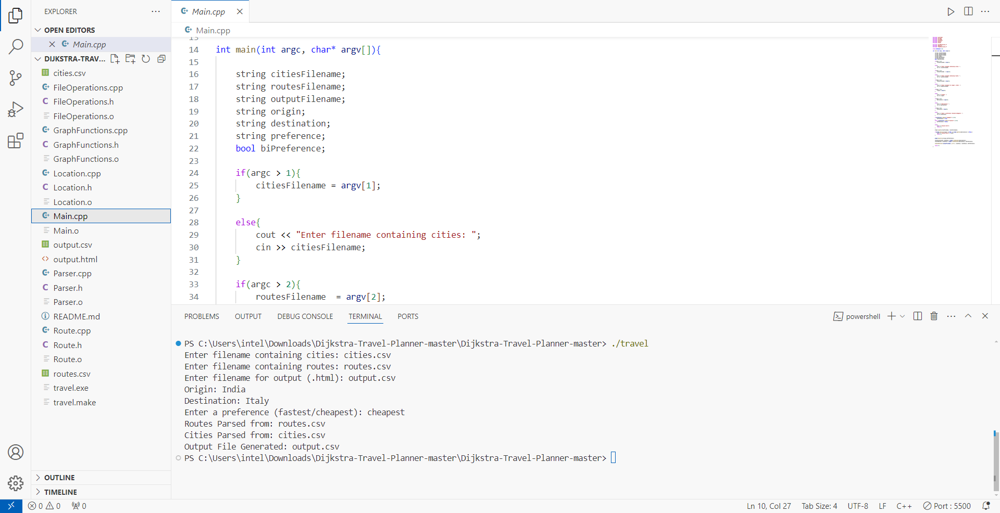
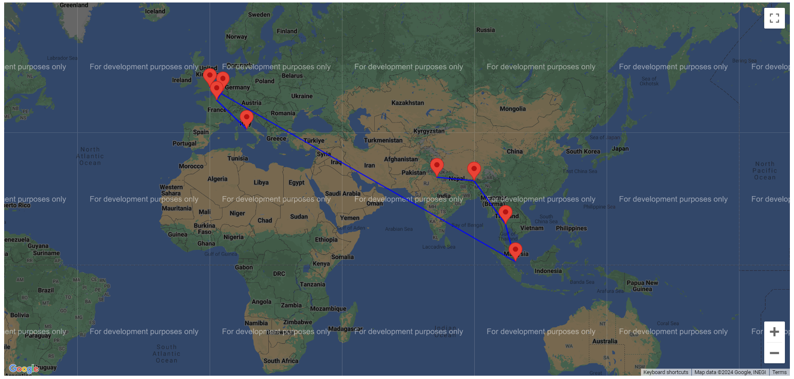

# Travel Planner with Dijkstra Algorithm

This project, implemented in C++, assists users in finding optimal routes between cities based on specified criteria.

## Description

- Allows users to input source and destination cities.
- Offers options to choose between the fastest or the cheapest route.
- Generates output in `output.html`, displaying the chosen route on a map interface.
- Utilizes datasets of cities and routes to determine optimal paths.

## About Dijkstra Algorithm

- **What is Dijkstra Algorithm?**
  - Dijkstra Algorithm computes the shortest paths from a source node to all other nodes in a graph with non-negative edge weights.
  - It efficiently finds the optimal path for our Travel Planner project based on user input and selected criteria.

## Why Dijkstra Algorithm?

- **Reasons for Choosing Dijkstra Algorithm:**
  - Ensures the shortest or optimal path based on the user's choice (fastest or cheapest).
  - Well-suited for the project's requirements, efficiently handling the city and route dataset calculations.
  - Performs well for sparse graphs such as city maps, providing accurate and efficient route calculations.

## Compiling Instructions

- **Instructions:**
  - Compile the project using a C++ compiler.
  - Run the executable and follow the prompts to input source, destination, and preferred route criteria (fastest or cheapest).
  - Open `output.html` in a web browser to view the generated route on the map.

## Code Snippet - 1

- **Input -> Fastest Path:**
  - 

- **Output -> Fastest Path:**
  - 

## Code Snippet - 2

- **Input -> Cheapest Path:**
  - 

- **Output -> Cheapest Path:**
  - 
